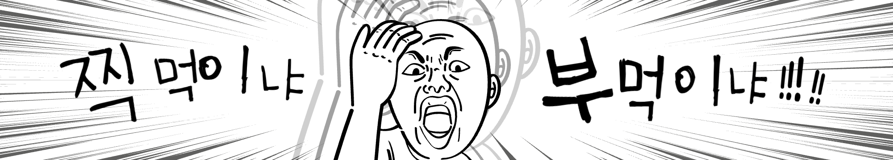
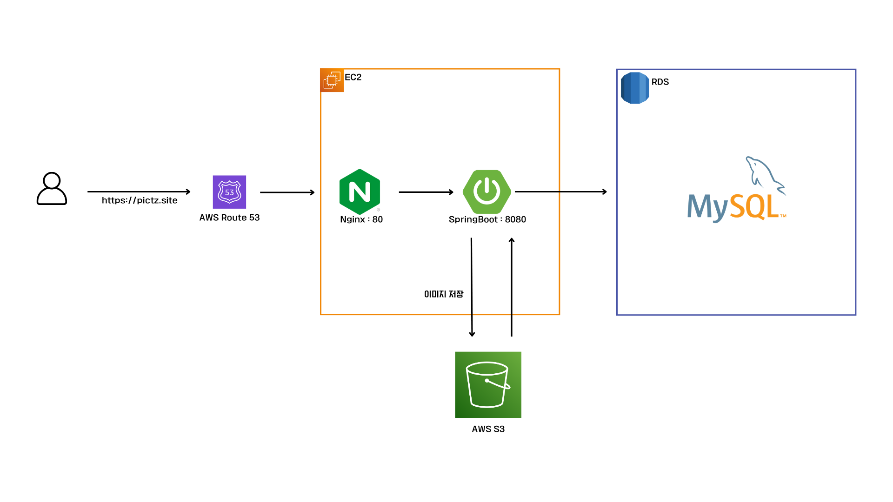
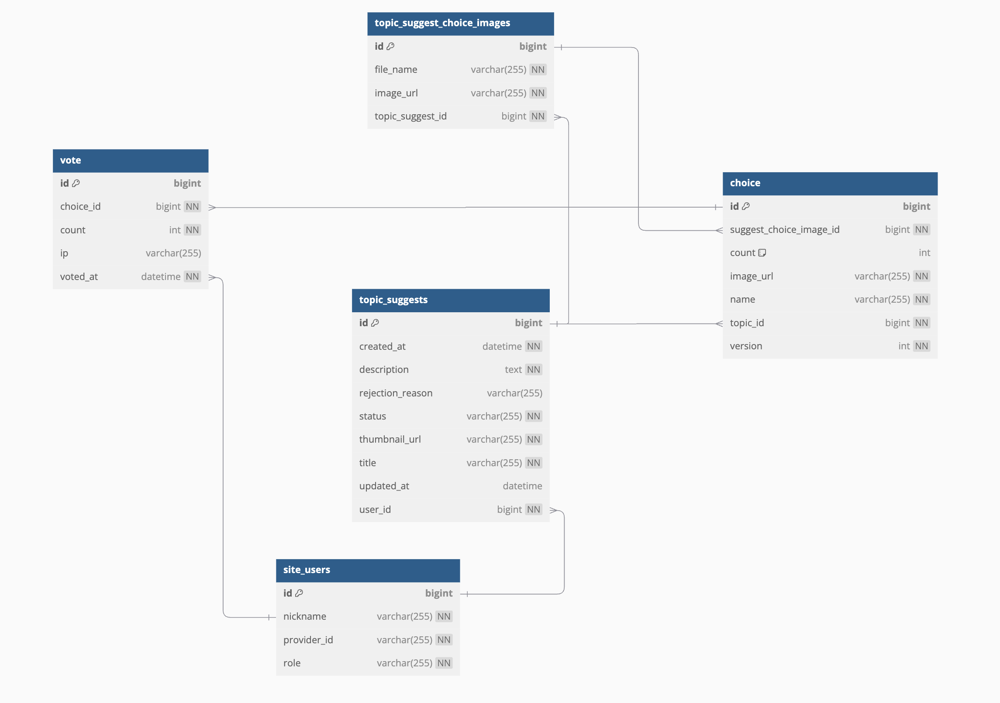

## 🚀<a href="https://pictz.site" target="blank">Pictz 바로가기</a>

### **👊🏻 VS 월드컵은 Pictz에서 투표하세요!**

### 아키텍쳐

### ERD

## 트러블 슈팅

**1. 메인 페이지 캐싱 전략 및 부하 테스트 진행** #94
- 실제 가상 머신(EC2 Free Tier와 유사한 환경)에서 Caffeine Cache와 Redis 캐시를 적용해 부하 테스트를 진행

**2. 투표 동시성 문제 해결 과정** #112
- 전체 synchronized 적용
- 부분 synchronized 적용  
- Atmoic 및 Concurrent를 이용

**3. 비효율적으로 투표 요청마다 DB에 저장하는 과정 개선하기** #96
- 클라이언트 조건부 투표 결과 전송
- 투표 정보 메모리 임시 저장
- 일정 시간마다 투표 정보 batch로 일괄 저장  
