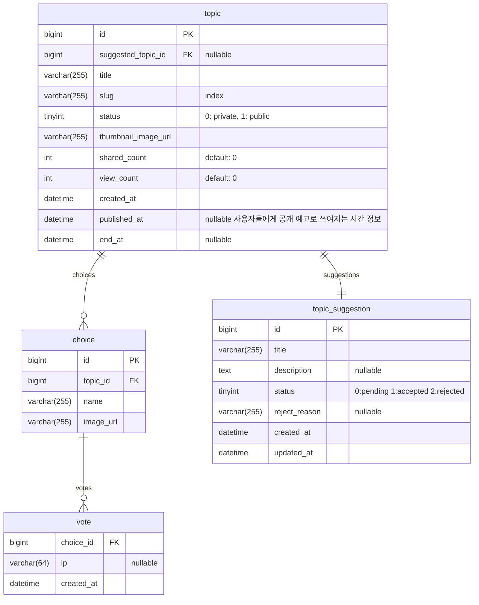

# pictz

## ERD



## 커밋 메세지

```
type (option): message #issue

* body 1
- body 2
```

### 타입

- feat: 새로운 기능 추가
- fix: 버그 수정
- docs: 문서 관련 작업
- style: 코드 스타일 변경 (코드 동작에 영향을 미치지 않는 변경 사항)
- refactor: 리팩토링
- perf: 성능 개선
- test: 테스트 관련 작업
- ci: CI 구성 파일 및 스크립트 변경
- chore: 그 외 자잘한 작업 (빌드 스크립트 수정, 패키지 관리자 구성, 외부 종속성 변경 등)

### 옵션

- breaking: 커밋에 breaking change가 있는 경우

### 메세지

- 명령문, 현재 시제로 작성: "변경함", "추가함" 대신 "변경", "추가"
- 끝에 마침표(.) 금지
- 최대 50자 이내로 작성. 초과할경우 body에 작성하기

### 예시

```
feat: 댓글 기능 추가
fix: 로그인 버그 수정
docs: README 파일 업데이트
style: 들여쓰기 규칙 변경
refactor: 코드 리팩토링
perf: 랜더링 성능 개선
test: 댓글 기능 테스트 코드 작성
ci: Gitaction CI 설정 파일 변경
chore: 코드 포매팅
feat(breaking): API 변경으로 인한 새로운 인증 방식 도입
fix: 특정 디바이스에서의 스타일 깨지던 현상 수정 #123
```

